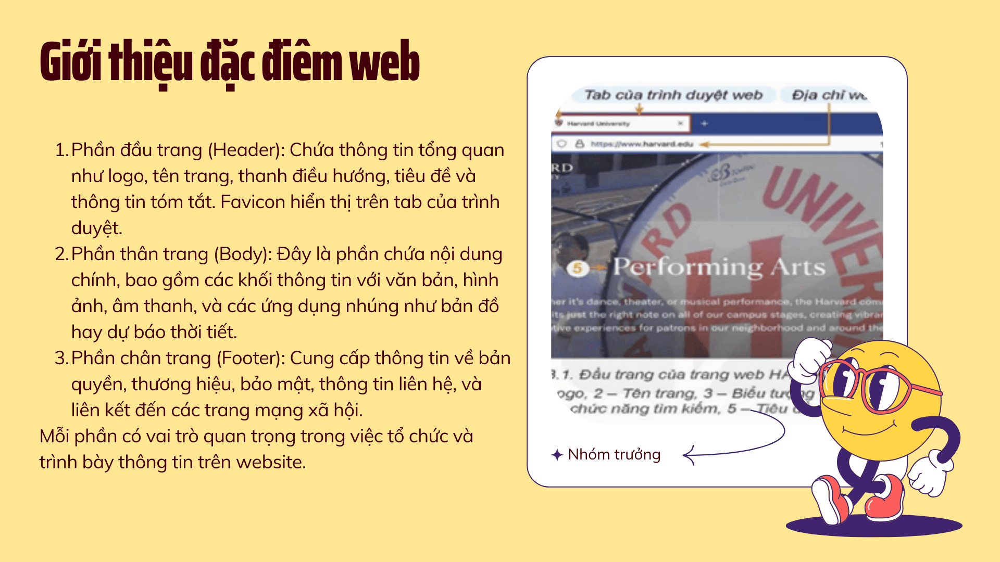
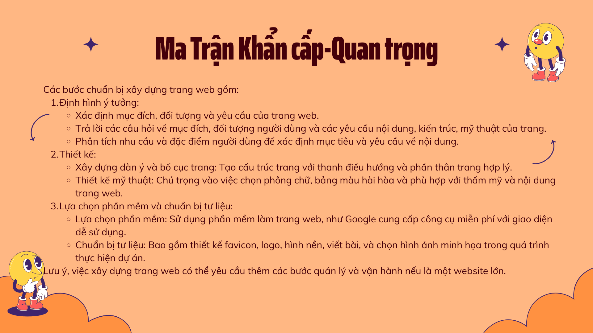
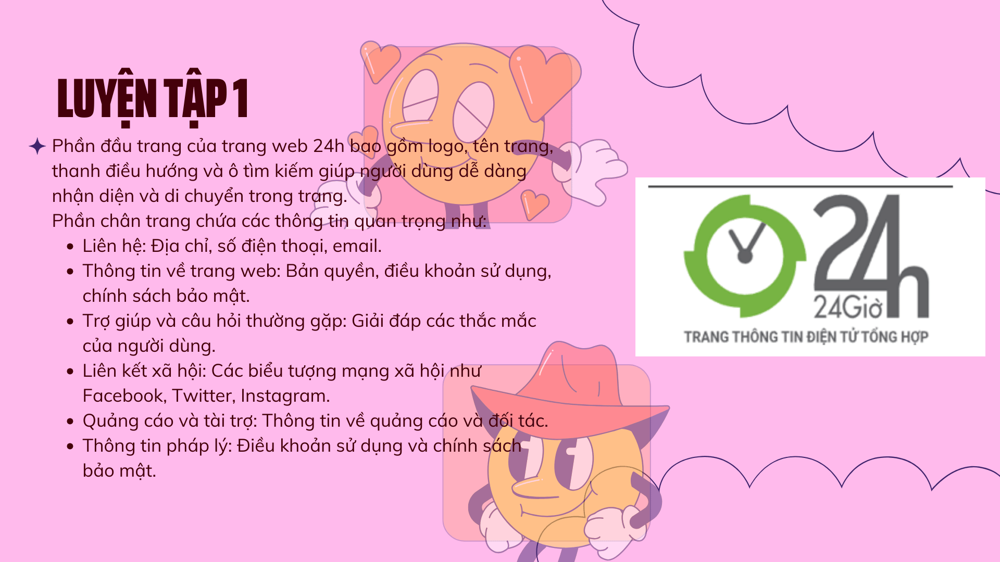
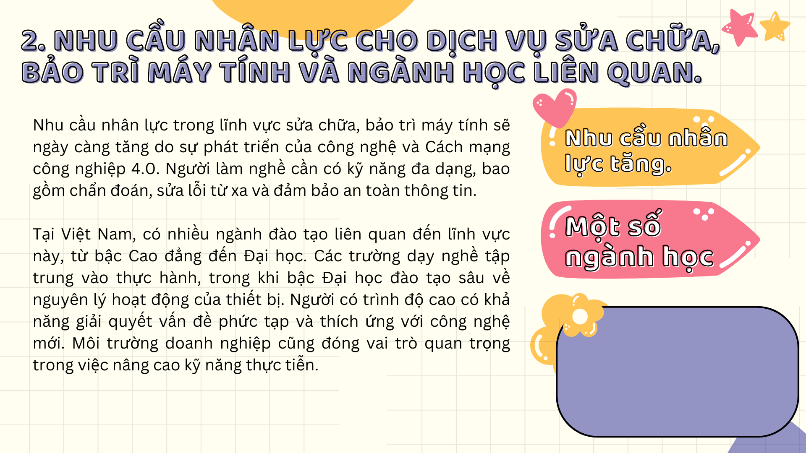
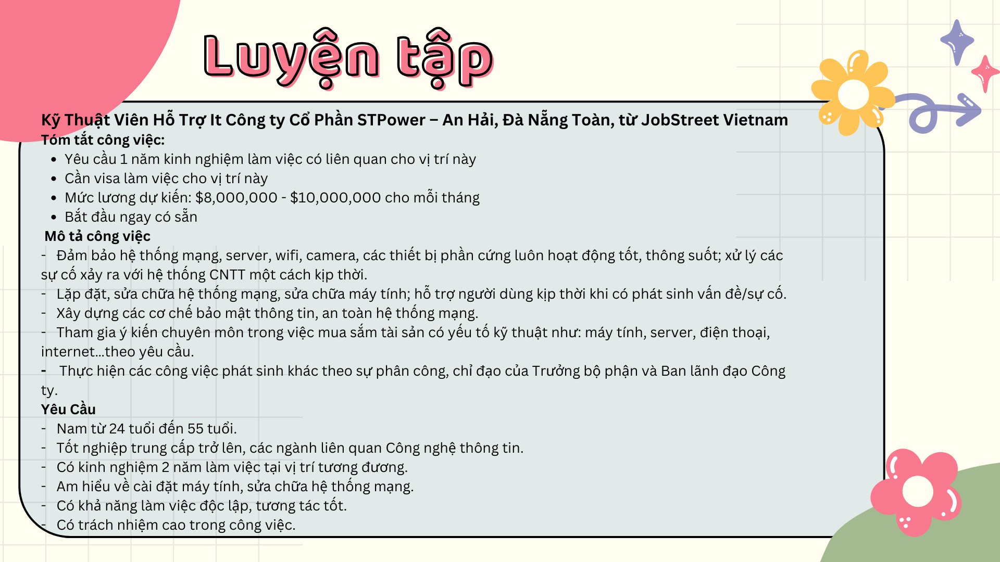
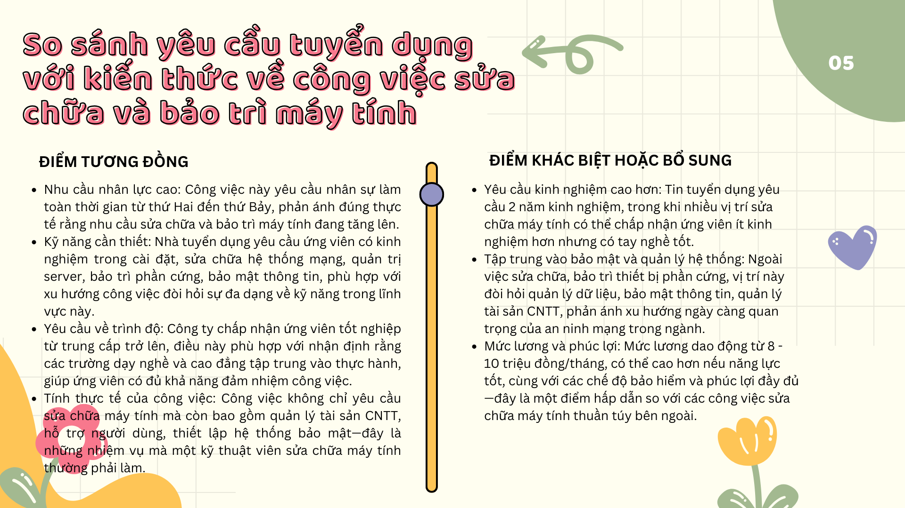

<!DOCTYPE html>
<html lang="vi">
<head>
    <meta charset="UTF-8">
    <meta name="viewport" content="width=device-width, initial-scale=1.0">
    <title>Trang Web Ảnh</title>
    
</head>
<body>
    

        <h1>Thuyết trình tin học</h1>
        

            
            
            
            
            
            
            
            
            
            
            
        

    

</body>
</html>
